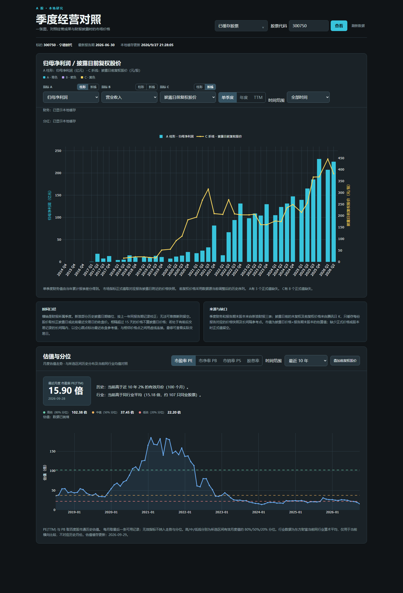

# A 股季度分析页面

一个运行在本机的季度财务柱线图。输入沪深 A 股六位代码，可为固定青色的 A、紫色的 B、黄色的 C 分别选择指标和柱形或折线表现形式；重复点击已选形式可隐藏该组，同时保留已选指标。可选指标包括营业收入、归母净利润、营收与归母净利润同比增长率、ROE（TTM 估算）、ROIC（简化估算）、经营活动现金流净额、简化自由现金流、已实施的估算现金分红、毛利率、净利率、资本开支 CapEx、有息负债、净现金／净负债、披露日估算市值或披露日前复权股价，并可查看单季度、年度和滚动四季度（TTM），按报告期筛选全部时间、最近 10 年或最近 5 年（默认全部时间）。本文以 300750 宁德时代作为演示标的，图表默认显示归母净利润青色柱形与前复权股价黄色折线；B 组预选营业收入但默认隐藏。三组柱形同时显示时并排排列，单季度横轴在跨年处增加间隔；不同单位分别显示对应纵轴。

页面下方还有估值图，可切换 PE(TTM)、PB、市销率 PS(TTM)、近 12 个月已实施现金分红股息率及最近 10/5/3 年。估值事实保存来源真实观察日期；展示可选自动、日、周、月，自动模式下 3 年用日、5 年用周、10 年用月。悬停显示各指标实际取值日期，早期稀疏历史不插值。分位样本频率独立于图表频率，相同范围内切换频率不改变分位。PE/PB/PS 还与当前同行业平均值比较；图表选择在浏览器内保留。

最近观察卡片按各指标自己的最近有效值和实际观察日期显示；较晚的其他指标或股价记录不会清空已有股息率。股息率为 0% 仍是有效观察。历史样本存在但当前分位不可计算时显示明确提示，不显示空值百分比。

卡片按所选年限的历史分位显示五档位置：≤20% 为低位，20%–40%（不含端点）为偏低，40%–60%（含端点）为中值，60%–80%（不含端点）为偏高，≥80% 为高位；股息率两端改为低息/高息。卡片同时显示年限与分位，切换图表展示频率不改变判断；缺少当前值或有效分位时显示待判断。此分类仅表示自身历史位置，不是内在价值估算。

顶部“我的股票”以分组侧栏选择已查询股票，内置最近查看（最多 20 只）、全部股票和未分组。搜索始终覆盖全部股票，支持代码、中文名称、拼音全拼和首字母；方向键定位结果，回车打开第一条结果，Escape 关闭选择器。新股票仍通过六位代码栏查询。

新增股票或旧库缺少名称时，财务异步接口通过腾讯行情补齐名称并保存到 `instruments.name`，同时更新选股列表和拼音搜索；打开页面和搜索时不请求外部名称接口。名称获取失败保留已有财报并显示提示，下次加载继续重试；已有名称直接沿用。

“管理分组”可新建、重命名、删除自建组，勾选股票后批量加入或移出当前管理组；同一股票可加入多个组。自建组使用侧栏的上移／下移按钮排序，固定组保持置顶。选中自建组并清空搜索后，可拖动股票行左侧的 ⠿ 调整组内顺序，支持鼠标与触摸，列表边缘自动滚动；松开后保存，Escape 或松开到列表外取消，保存失败保留原顺序。股票行旁的上移／下移按钮继续支持微调和键盘操作。每个组独立保存，新加入的股票追加到末尾，重复加入保持原位置。最近查看按查看时间排列，全部股票和未分组按代码排列。删除组只解除该组归属，股票和已有数据仍保留。分组、排序、归属、最近查看及上次选择的分组均保存到本地 SQLite，关闭浏览器或重启后台后继续保留；窄屏下分组显示在股票列表上方。拼音搜索使用 `pypinyin`，依赖已列入 `requirements.txt`。

“筹码评估”区域有两张独立加载的双轴趋势图：股东人数与股价，以及融资与股价。两图默认显示前复权收盘价，也可切换为不复权；股东人数按统计截止日采样，可选全部时间、最近 10 年或 5 年，悬停显示公告日与实际价格日期。融资图可选 1 年、3 年、5 年，默认 1 年；1 年和 3 年按日展示，5 年按周展示，周度余额和股价取当周最后一条记录，融资净买入按周合计。可切换融资余额、融资融券余额或融资净买入。图表选项在当前标签页保留，加载不依赖财报成功。

## 页面预览

下图为 300750 宁德时代页面的实际截图：上方对照季度归母净利润和披露日前复权股价，下方展示月度估值与历史分位。截图中的数据和缓存日期仅代表截图时的状态。



## 启动

项目支持 Python 3.10 及以上版本。在仓库根目录安装依赖并启动：

```powershell
python -m pip install -r requirements.txt
python app.py --port 8766 --open-browser
```

上述命令打开 [http://127.0.0.1:8766/](http://127.0.0.1:8766/)。省略 `--port` 时默认端口为 `8765`；省略 `--open-browser` 时需手动打开页面。指定股票可访问 `http://127.0.0.1:8766/?code=300750`，不指定时使用程序默认标的。退出时在启动窗口按 `Ctrl+C`。服务只监听 `127.0.0.1`。

Windows 也可双击 [start_dashboard.bat](start_dashboard.bat)。该脚本依次使用用户设置的 `PYTHON_EXE`、项目 `.venv`、PATH 中的 `python` 或 Windows `py -3`，检查 Python 版本和依赖后启动默认 `8765` 端口。可传入 `--port` 等启动参数。关闭脚本窗口即停止服务。

数据源请求默认直连，不自动继承环境变量或 Windows 系统代理，避免本地代理造成 `ProxyError` / `SSLEOFError`。HTTPS 证书验证保持启用。需要代理时，可在同一个 PowerShell 窗口显式启用，并使用正确的 HTTP 代理地址（HTTPS 目标也可以通过 HTTP 代理的 CONNECT 隧道访问）：

```powershell
$env:DASHBOARD_USE_SYSTEM_PROXY = "1"
$env:HTTP_PROXY = "http://127.0.0.1:7890"
$env:HTTPS_PROXY = "http://127.0.0.1:7890"
python app.py --open-browser
```

修改连接设置后需重启服务。`data/` 不随 Git 同步；换电脑保留数据请用 [SQLite Backup API 备份及恢复命令](docs/sqlite-storage.md#维护命令)，仅复制代码则首次打开会重新取数。财报、分红、估值各自独立更新，来源失败时保留已保存事实并显示警告。

依赖版本见 [requirements.txt](requirements.txt)：运行依赖是 `requests` 和 `plotly`，测试另需 `pytest`，部分前端回归测试需要 Node.js。Plotly 脚本由本地 Python 包提供，页面不依赖 CDN；首次取数和后续更新仍需要访问外部数据源。

## 设计文档

数据源、代码文件用途、数据存储方式及加载、更新与备份流程见 [设计文档](docs/architecture-design.md)。

新浪关键指标、利润表、资产负债表及现金流量表的科目码、来源、覆盖情况和取数口径见 [财务四表数据字典](docs/financial-data-dictionary.md)；完整字段及有效值统计见 [CSV 清单](docs/financial-data-dictionary.csv)。

## 指标口径

- ROIC（简化估算）已接入 A/B/C 指标菜单，与现有指标共用财报抓取、缓存和周期计算；`quarterly_dashboard/roic.py` 仅封装纯计算函数，不单独抓取数据。年度视图取全年利润和上年末、本年末投入资本；单季度与 TTM 视图均取连续四季度利润和上年同期、本期投入资本，缺季度不按单季乘四补算。公式为 NOPAT＝（利润总额＋费用化利息－非经营性利息收入－`non_operating_adjustments`）×（1－所得税费用／利润总额）；ROIC＝NOPAT／期初、期末投入资本均值×100%。投入资本＝合并所有者权益（含少数股东权益）＋有息负债－现金扣除额。两个扩展口：资产负债数据的 `excess_cash` 将现金扣除额从全部货币资金替换为超额现金，需分别提供期初和期末值；利润数据的 `non_operating_adjustments` 用于剔除同一年度或 TTM 窗口的税前非经营性净收益，正数扣减收益、负数加回损失，不含已单独扣除的非经营性利息收入。未提供两个键时分别默认全部货币资金、零调整；显式提供 0 是有效数值，显式提供 `None` 表示未知并返回空值。利润和资本均需使用同一合并范围、币种及单位，费用符号由数据源层统一；缺关键输入、税率异常或平均投入资本非正时留空。利润总额、所得税费用、费用化利息、财务费用项下利息收入及合并所有者权益来自新浪利润表／资产负债表；旧缓存自动补齐这些字段，不重抓价格。区分金融业务的经营利息收入与财务费用项下利息收入，不把财务费用净额或经营利息支出代替费用化利息。新浪部分公司将费用化利息按负号展示，仅此费用科目在源层统一为正费用金额，缺值不填零。报表扩展字段 `non_operating_adjustments_ytd` 按年内累计值保存，拆季和 TTM 汇总后传入计算函数的 `non_operating_adjustments`；两个扩展口在自动迁移与手动刷新中均保留。页面打开时随其余指标计算 ROIC，SQLite 保存原始财报事实和手工覆盖。当前扣全部货币资金且未剔除其他投资收益、处置损益，仍是简化估算；历史关键字段不足的报告期留空。
- 营收和归母净利润来自季度利润表的当年累计值；经营活动现金流净额来自同一新浪接口的现金流量表累计值。单季度按相邻累计期差分，TTM 汇总连续四个单季度。缺季度时留空。现金流量表独立同步，不重抓价格。
- 营收和归母净利润同比增长率均按去年相同报告期、相同单季度/年度/TTM 口径计算；基期小于等于零或缺失时留空。ROE（TTM 估算）＝最近连续四季度归母净利润÷本期与上年同期归母净资产均值，不是官方加权平均 ROE；净资产非正或缺期时留空。
- 第一张图的金额类指标在柱形和折线悬停时追加同比，例如“归母净利润：100.00 亿元；同比 +20.00%”。适用于营收、归母净利润、经营现金流、简化自由现金流、估算现金分红、CapEx、有息负债及净现金；股价、市值、增长率指标、ROE、ROIC 和利润率不追加。单季度与上年同季度比较（非累计值），年度与上年全年比较，TTM 与上年同期 TTM 比较；期末债务和净现金比较上年同一报告期末。同比在打开页面生成完整周期数据时临时计算，不写入缓存，筛选时间范围后仍可使用范围外的上年数据。正基数显示带符号的两位小数百分比，无变化显示 0.00%；净利润跨越盈亏或两期均亏损时显示扭亏为盈、转亏、亏损收窄／扩大等文字，其他负值指标显示由负转正、由正转负、负值收窄／扩大等。零基数和缺少同期数据明确标注原因。分红同比仅比较归属报告期的已实施金额，并在悬停注明“仅已实施口径”；当前数据不能判断是否已实施全部分红，进度差异可能影响同比。
- 简化自由现金流＝经营活动现金流净额－购建固定资产、无形资产和其他长期资产支付的现金；单季度和 TTM 按相同周期转换。它是现金流量表口径的简化估算，不等于精确可分配现金。
- 分红指标仅在年度视图的悬停详情追加“分红率”：该年度归属的已实施估算现金分红÷全年归母净利润×100%，季度与 TTM 不显示。年度分红包括次年实施但归属本年度的派息；未实施的分红不计入，因此该比例不代表最终全年派息率。净利润非正或任一输入缺失时标注无法计算，有效零分红显示 0.00%，超过 100% 保留实际值。比率随年度视图生成，不写入原始缓存。
- 估算现金分红取东方财富已实施记录的税前每股派息、总股本、归属报告期与实际除权日；每笔金额＝每股派息×接口总股本。单季度按归属报告期汇总，年度合计该年所属分红，TTM 合计最近四个报告季度。悬停显示实际除权日，因此 2025 年年报分红即使在 2026 年发放，也归入图上的 2025 年。仅计已实施记录；0 表示截至缓存更新时没有已实施分红，不能据此推断未来不会分红。回购股不参与分红、股本变动及 A/H 股不同实施口径等都可能使估算额与公告实付总额不同。原始分红事件保存在 SQLite 中，图表金额按显示周期计算。
- 毛利率＝（营业收入－营业成本）／营业收入；净利率＝合并净利润／营业收入，区别于归母净利率。两者均按所选单季、年报累计或 TTM 口径计算，收入非正或缺字段时留空。CapEx 直接取现金流量表上述购建长期资产现金支出，单季差分、TTM 滚动加总。
- 有息负债（简化）＝短期借款＋应付短期债券＋一年内到期的非流动负债＋长期借款＋应付债券＋租赁负债；净现金／净负债＝报告期末货币资金－有息负债，正值为净现金，负值为净负债。两者为报告期末时点值，切换单季／年度／TTM 时不加总。只在债务组成科目完整时计算，报表列有科目但值为空按零处理；货币资金可能包含受限资金，部分“一年内到期的非流动负债”可能并非有息债务，这些指标不可视为精确的可用现金或净债务。利润表与资产负债表独立同步，不重抓价格。
- 股价取财报披露日或此前最近交易日的腾讯日 K 收盘价；相隔超过 15 天不计入披露日价格。若披露日处在有前后交易记录的长间隔内，且距前一交易日 16–180 天，图上以空心圆点显示最近收盘参考值，悬停标明实际交易日和相隔天数。与参考点相连的趋势段使用虚线，正常价格点之间使用实线。财务和完整共享日线均从 SQLite 读取；披露日价格快照按需匹配。
- 新浪历史记录的 `publish_date` 存在向后错一年的情况。页面按上一年同报告期记录校正，并保留原字段 `source_publish_date` 供核对；无法得到可信日期的早期报告留空。300750 的 2021 年年报已与深交所 2022-04-22 公告核对。
- 股本取同一报告期资产负债表的“实收资本（或股本）”；披露日估算市值＝对应交易日未复权收盘价×报告期末股本。长间隔参考市值也按最近收盘价×报告期末股本计算，仅是参考值。股本并非披露日实时股本，因此不是精确历史市值。
- 前复权股价取同一披露日对应的腾讯前复权日 K，仅用于走势，不用于市值。该序列的历史值可能为负，页面保留数据源原值，不把负数当作缺失。
- 横轴是报告期；悬停同时列出财报实际披露日与价格采样日。图表是事后对照，不能当作当时已经公开的估值。

估值图的 PE(TTM)、PB 和总市值观察来自百度股市通，按真实日期逐条保存。PS(TTM) 为每个市值观察日的总市值 ÷ 当时已披露财报的 TTM 营收；市值按亿元转换为元。图表按日、周或月聚合，周/月取周期最后一个有效观察并保留实际取值日期。股息率＝截至观察交易日前 365 天内已实施现金分红的税前每股金额之和 ÷ 当日未复权收盘价 × 100%；`PRETAX_BONUS_RMB` 为每 10 股金额，计算时除以 10。图上可叠加共享前复权股价，按展示周期独立匹配共享日 K 的最后交易日价格，不要求股价日期与估值观察日期一致；悬停保留真实交易日。整周期无交易时连接前后已有价格点，最后交易日缺少前复权股价时保留断点，缺失日期不补造。PE 为负或指标无效时不参与分位计算；负 PE 原值仍保存在 SQLite，PE 图以浅色区域和日期说明标示所选范围内的负值观察区间，走势保持断线；说明不随日/周/月展示频率变化，缺失或零值不标记为负 PE；PE/PB/PS 的近 5 年分位固定按周取最后一个有效观察，有共享行情日期时仅使用交易日，缺周不补值；其余时间窗口的稀疏历史按月末有效观察取样，密集历史使用交易日样本。分位和高/中/低参考线使用同一组样本，不随图表展示频率改变。同行业均值是当前横向快照，不能与历史月份直接对照。财报历史值可能包含后续修订，估值图并非严格的历史实时回测。正常读取 SQLite，旧月度 JSON 仅保留为带旧版本的兼容快照。

普通刷新使用财报每类最近 8 期、分红公告/除权日期窗口和估值每指标近一年窗口；长期离线与 30 天审计按需扩大范围。来源返回缺页、丢失已有关键字段或请求失败时保留已提交事实并显示警告。事实和同步水位在同一 SQLite 事务写入，成功后刷新当天 Backup API 备份。旧月度估值快照与新逐日观察使用不同取样版本，不混合计算；前复权价格继续按独立版本保护。

目前保存共享的不复权和前复权完整逐日价格历史，尚不保存完整历史成交额，也不做精确历史股本与财报修订的点时版本计算。此前的阶段 0 资料保留在 `docs/data-sources/`。范围变更记录见[季度页面方案](docs/plans/2026-09-27-quarterly-dashboard.md)。

## 筹码数据与存储

- 股东人数来自东方财富 F10 的 `RPT_F10_EH_HOLDERNUM`，以 `RPT_HOLDERNUM_DET` 补充额外统计日期，同日期优先 F10。采用总股东户数口径，A/H 股公司不一定仅包含 A 股股东。横轴使用 `END_DATE`，公告日期单独保留，不能视为统计截止日已经公开的信息。人数显示万户，悬停给出完整户数。
- 股东人数事实与价格分别更新。价格来自共享腾讯日 K，取统计截止日或此前最近交易日，最多回退 15 天；不使用 F10 的 `PRICE`。F10 和详情来源、总股东户数与未知口径分别保留。价格失败时已验证的股东事实仍可入库。
- 融资数据来自东方财富 `RPTA_WEB_RZRQ_GGMX`，包括融资余额、融资融券余额与允许为负的融资净买入。首次导入/更新保留完整历史，后续从成功水位回看 30 个自然日；图表查询最近五个日历年的日度记录，并按所选范围展示，历史不因展示范围缩小而删除。
- 筹码事实和共享日价持久化在 `data/stock_analysis.sqlite3`。不复权日价与前复权完整版本分别保存；前复权增量核对最近 20 个已有交易日及两个旧锚点，定期全量核对。页面异步接口固定读取同一个价格版本，过期版本提示重新协调。
- `data/chips/`、`data/fundamentals/`、`data/valuation/` 下的旧 JSON 用于幂等导入和保留原始备份；正常业务从 SQLite 读取。数据源失败或历史覆盖不足时保留已验证事实与价格版本。

## 检查

P0–P4 已实现；P4 在隔离库通过本机验收。当前结构版本为 8，支持股票分组、归属、组内顺序、最近查看和选择偏好；版本 4 的融资 JSON 精简继续保留数值、原始响应和必要沿用来源。旧库在新版首次启动时自动迁移，并在升级前生成一致备份。启动会检查结构、恢复中断任务并生成一致备份；成功业务更新后刷新当日备份。当前 Python 3.11.9 / SQLite 3.45.1 使用 DELETE journal。WAL 修复版和另一台电脑的恢复演练仍属于 P5 待验收项。维护命令见 [SQLite 存储说明](docs/sqlite-storage.md)，实测和限制见 [P4/P5 验收记录](docs/data-sources/p4-acceptance.md)。

测试依赖需另行安装；前端悬停、轴范围和后台加载回归还需要系统中可执行的 `node`，未安装时对应测试会跳过。拖拽回归另需 Edge 和提供全局 WebSocket 的 Node（本机 Node 24）；使用隔离数据库、临时浏览器配置和系统分配的空闲端口，覆盖真实鼠标、触摸、双向自动滚动及保存失败恢复。

```powershell
python -m pip install pytest
python -m pytest tests -q
```

## 投资 checklist

原 AI 研判页面已替换为 18 项定性 checklist，复用 ChatGPT 接入、本地财务四表和其他历史数据；年报、中报原件与解析按版本缓存。旧研判代码及历史保留。使用、资料导入和完整备份见 [checklist 说明](docs/ai-stock-assessment.md)。
